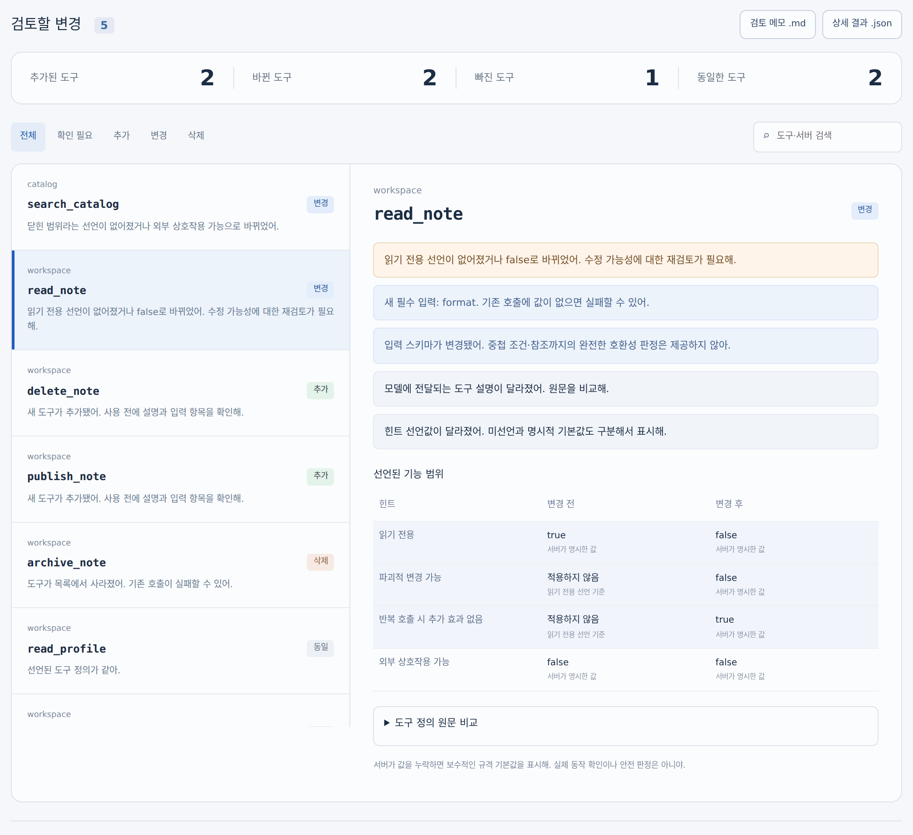
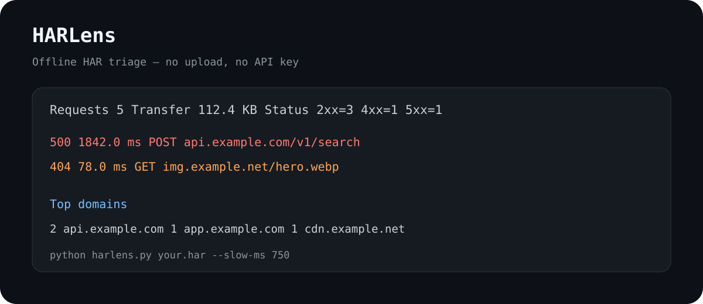

# BlueBWorks

## [ScopeDiff](projects/scopediff/)

MCP 업데이트 전후의 도구 목록을 비교하는 로컬 도구입니다. 새로 생기거나 사라진 도구, 설명·입력 항목의 변경을 확인하고 결과를 저장할 수 있습니다. API 키나 서버 연결 없이 사용할 수 있습니다.

## [HARLens](projects/harlens/)

브라우저 DevTools에서 저장한 HAR 파일을 외부 업로드 없이 분석해 실패 요청, 느린 요청, 도메인별 호출 수, 상태 코드 분포와 전송량을 빠르게 보여주는 로컬 진단 도구입니다.

