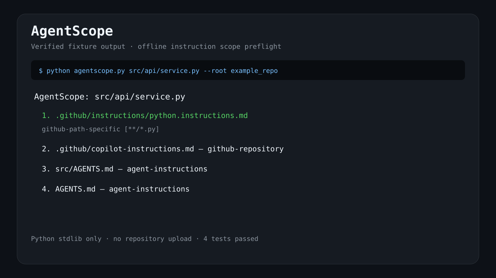

# AgentScope

When a repository contains `AGENTS.md`, `.github/copilot-instructions.md`, path-specific `*.instructions.md`, `CLAUDE.md`, and `GEMINI.md`, AgentScope shows which instruction files apply to one target path before an AI coding agent runs.

It uses only the Python standard library and sends no repository data anywhere.

[](preview.svg)

## Run

```bash
cd projects/agentscope
python agentscope.py src/api/service.py --root /path/to/repository
python agentscope.py src/api/service.py --root /path/to/repository --json
```

The output is ordered by the documented GitHub Copilot instruction precedence: path-specific instructions, repository-wide instructions, then agent instruction files. Nested `AGENTS.md` files closer to the target are shown before broader ones.

## Test

```bash
python -m unittest -v test_agentscope.py
```

## Scope and limits

AgentScope is a read-only preflight. It does not execute or rewrite instructions, does not reproduce every vendor's private runtime behavior, and does not judge semantic conflicts inside natural-language rules.

## Background and alternatives

- GitHub Copilot custom instructions: https://docs.github.com/en/copilot/concepts/prompting/response-customization
- OpenAI Codex custom code review rules: https://developers.openai.com/ko-KR/blog/custom-code-review-rules-for-codex
- GitHub Copilot can show instruction references during its own workflow; AgentScope works before a session starts.
- rulesync (https://github.com/dyoshikawa/rulesync) synchronizes rule formats; AgentScope only maps scope and never changes files.
