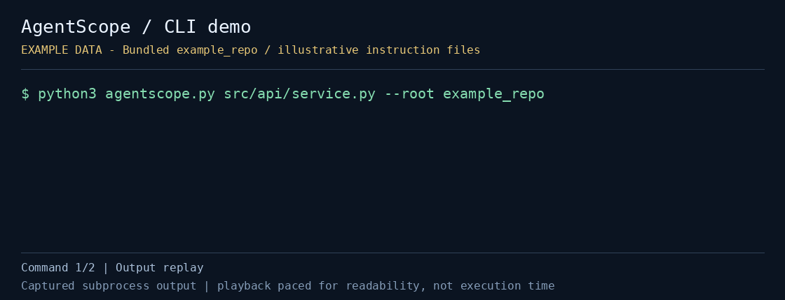

# AgentScope

Find the supported AI instruction files that apply to a file or directory before starting a coding-agent session. AgentScope reads a local repository, prints matching paths in its inspection order, and does not execute or rewrite instructions.

Python 3.9+ is required. The CLI uses only the standard library and sends no repository data anywhere.

[](demo.gif)

This demo shows actual CLI output using bundled sample/fixture data; playback is paced for readability. It is not a recording of an AI agent following those instructions.

[Static preview](preview.png) · [Captured output](demo-transcript.txt) · [Capture metadata](demo-capture.json)

## Quick start

From the repository root:

```bash
cd projects/agentscope
python3 agentscope.py src/api/service.py --root example_repo
python3 agentscope.py src/api/service.py --root example_repo --json
```

Inspect your own repository by replacing the root and target:

```bash
python3 agentscope.py src/api/service.py --root /path/to/repository
```

- `target`: a file or directory inside the repository. Relative targets are resolved against `--root`; a planned path does not have to exist yet
- `--root`: repository root, defaulting to the current working directory
- `--json`: emit `target`, `applicable`, and `skipped` records, including each match's kind, precedence value, reason, and patterns
- `--help`: show the command-line options

Successful inspection returns exit code `0`, including when no files apply. An out-of-root target or caught filesystem error returns `2`.

## What the output means

AgentScope inspects these locations:

1. Matching `.github/instructions/**/*.instructions.md` files with usable `applyTo` frontmatter
2. The root `.github/copilot-instructions.md`
3. `AGENTS.md` files along the target's ancestor path up to the root
4. Root-level `CLAUDE.md` and `GEMINI.md`

The bundled target matches a Python-specific rule, repository-wide instructions, `src/AGENTS.md`, and the root `AGENTS.md`. The example Markdown rule does not apply to the Python target.

The ordering is AgentScope's model: path-specific rules first, repository-wide instructions second, then agent files. Deeper `AGENTS.md` files get a lower precedence number, capped at nine directory levels; ties are sorted by path. This is an inspection aid, not a guarantee of any coding agent's runtime behavior. Files without usable `applyTo` are reported under `skipped`; valid nonmatching rules are omitted.

## Tests

Run from this project directory:

```bash
python3 -m unittest -v test_agentscope.py
```

The tests cover glob matching, example ordering, exclusion of nonmatching rules, and JSON output.

## Scope and limits

- `applyTo` parsing supports a single-line comma-separated string or JSON-style array. It is not a general YAML parser
- Glob matching supports `*`, `**`, `**/`, and `?`, not every vendor-specific pattern feature
- Nested `CLAUDE.md`/`GEMINI.md`, user-level rules, editor settings, and unsupported instruction formats are not scanned
- The tool reports file scope and order; it does not read rules for semantic conflicts or verify that an agent will obey them

## Regenerate the demo

From the repository root, with Pillow installed in the capture environment:

```bash
python3 automation/capture_cli_demos.py --project agentscope
```

Pillow is needed only to produce the GIF and PNG; it is not a CLI dependency. The capture also saves the command output and metadata linked above.

## Background and alternatives

- [GitHub Copilot custom instructions](https://docs.github.com/en/copilot/concepts/prompting/response-customization)
- [OpenAI Codex custom code review rules](https://developers.openai.com/ko-KR/blog/custom-code-review-rules-for-codex)
- [rulesync](https://github.com/dyoshikawa/rulesync) focuses on synchronizing rule formats; AgentScope only maps supported local scope and never changes files
