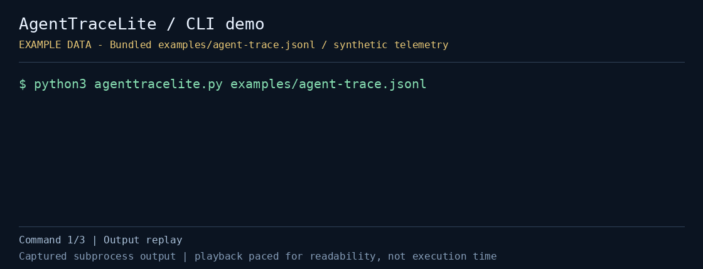

# AgentTraceLite

Inspect an existing OTLP trace JSONL file locally without running a tracing backend. AgentTraceLite shows span duration, error status, service, agent/tool categories, model or tool labels, and a token total when those attributes are present.

The CLI uses only the Python 3 standard library. It reads a local file, makes no network requests, and does not collect new telemetry.

[](demo.gif)

This demo shows actual CLI output using bundled sample/fixture data; playback is paced for readability. The bundled trace is illustrative, not a recording of a real agent session or evidence of model performance.

[Static preview](preview.png) · [Captured output](demo-transcript.txt) · [Capture metadata](demo-capture.json)

## Quick start

From the repository root:

```bash
cd projects/agenttracelite
python3 agenttracelite.py examples/agent-trace.jsonl
python3 agenttracelite.py examples/agent-trace.jsonl --category tool --slow-ms 500
python3 agenttracelite.py examples/agent-trace.jsonl --json
```

For your own export:

```bash
python3 agenttracelite.py /path/to/trace.jsonl --slow-ms 1000
```

- `trace_file`: a UTF-8 JSONL file containing OTLP trace export objects
- `--slow-ms N`: show text rows whose duration is at least `N` milliseconds; the default is `0`, and negative values are rejected
- `--category agent|tool|other`: filter text rows by the tool's heuristic category
- `--json`: emit the complete `summary` and `spans` arrays. In the current implementation, JSON output is not filtered by `--slow-ms` or `--category`
- `--help`: show available options

The text summary always describes all loaded spans, even when the displayed rows are filtered. A valid file returns exit code `0`, including when no rows match a filter or error-status spans are present. Caught file or validation errors return `2` and a diagnostic on stderr.

## Input format

Each nonblank line must be a complete JSON object with a `resourceSpans` array, using the nested structure `resourceSpans → scopeSpans → spans`. A multiline, pretty-printed JSON document is not JSONL and cannot be read directly.

Each span must include `traceId`, `spanId`, `name`, `startTimeUnixNano`, and `endTimeUnixNano`. Timestamps must convert to integer nanoseconds, and the end cannot precede the start. An empty file or export with no spans is rejected.

Optional fields used by the inspector:

- Resource attribute `service.name`
- Numeric status code `2` for `ERROR`, `1` for `OK`; other codes are displayed as `UNSET`
- `gen_ai.operation.name`, `gen_ai.request.model`, `gen_ai.tool.name`, and `tool.name`
- `gen_ai.usage.input_tokens` and `gen_ai.usage.output_tokens`

Missing service names appear as `(unknown-service)`. Missing model, tool, or token attributes do not stop inspection.

## Reading the result

The bundled fixture contains one trace and three spans: two categorized as `agent` and one as `tool`. Its summary has one error and 820 tokens. These are sample values, not measurements from a live service.

- Duration is `(endTimeUnixNano - startTimeUnixNano)` converted to milliseconds
- A tool-name attribute or `tool` in the span name assigns the `tool` category first
- Otherwise, `gen_ai.operation.name` or the exact span names `invoke_agent`/`chat` assign `agent`; other spans are `other`
- Token totals sum integer-convertible input/output values across all spans. Overlapping or repeated instrumentation can double-count usage, so the number is not a billing estimate
- Rows remain in input order. This is a flat span listing, not a parent/child tree or critical-path view

## Tests

Run the bundled checks from this project directory:

```bash
python3 check_agenttracelite.py
```

The check verifies fixture span count, heuristic categories, error/token totals, and the tool-duration selection. It is a small fixture-based check, not a complete OTLP conformance suite.

## Limits and privacy

Only trace JSONL is supported, not protobuf, metrics, logs, or a live collector endpoint. The parser expects the supported OTLP object shape and performs basic checks; it is not a full schema validator. Categories depend on names and attributes, and token data may be missing or duplicated.

The tool does not upload your file. Its output still contains trace IDs, span names, service names, and model/tool labels, so review an export or transcript before sharing it.

## Regenerate the demo

From the repository root, with Pillow installed in the capture environment:

```bash
python3 automation/capture_cli_demos.py --project agenttracelite
```

Pillow is needed only to produce the GIF and PNG; it is not a CLI dependency. The capture also saves the command output and metadata linked above.

## Format reference and alternatives

- [OpenTelemetry file export format](https://opentelemetry.io/docs/specs/otel/protocol/file-exporter/)
- [OpenTelemetry Protocol](https://opentelemetry.io/docs/specs/otlp/)
- [Jaeger](https://www.jaegertracing.io/) and [Grafana Tempo](https://grafana.com/oss/tempo/) are options when you need a tracing backend rather than quick inspection of an existing file
