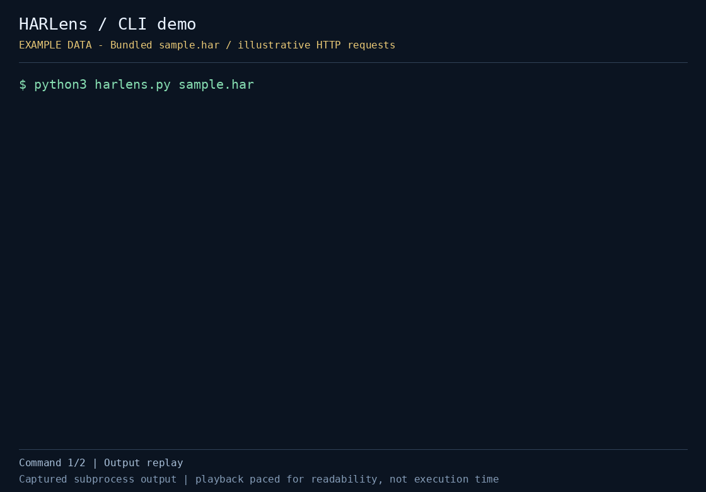

# HARLens

브라우저 DevTools에서 저장한 HAR(JSON) 파일을 **외부 업로드 없이 로컬에서** 빠르게 훑는 작은 진단 도구입니다. 실패한 요청, 느린 요청, 도메인별 호출 수, 상태 코드 분포와 응답 크기 합계를 보여줍니다.

Python 3 표준 라이브러리만 사용하며 추가 패키지나 서버가 필요하지 않습니다.

[](demo.gif)

저장소에 포함된 예제/fixture 데이터로 실행한 실제 CLI 출력입니다. 재생 속도는 읽기 편하게 조정했습니다. 예제의 오류와 지연은 실제 서비스 장애를 뜻하지 않습니다.

[정지 미리보기](preview.png) · [실행 출력](demo-transcript.txt) · [캡처 정보](demo-capture.json)

## 빠른 실행

저장소 루트에서 실행합니다.

```bash
cd projects/harlens
python3 harlens.py sample.har
python3 harlens.py sample.har --slow-ms 250
python3 harlens.py sample.har --json
```

실제 입력은 브라우저의 Network 패널에서 내보낸 HAR 파일로 바꿉니다.

```bash
python3 harlens.py /path/to/your.har --slow-ms 750
```

- 첫 번째 인수는 UTF-8 HAR JSON 파일 경로입니다
- `--slow-ms N`: 요청 시간이 `N`밀리초 이상인 항목을 느린 요청으로 분류합니다. 기본값은 `1000`입니다
- `--json`: 텍스트 대신 전체 분석 결과를 JSON으로 출력합니다
- `--help`: 명령행 도움말을 표시합니다

## 결과 읽기

- `Requests`: `log.entries`에 들어 있는 전체 요청 수
- `Transfer`: `response.bodySize`의 합계. 음수인 경우 `response.content.size`로 대체하며, 남은 음수는 0으로 처리합니다. 헤더 등을 포함한 정확한 네트워크 전송량은 아닙니다
- `Aggregate request time`: 개별 요청 시간의 합계. 병렬 요청도 각각 더하므로 페이지 로딩 시간과 다릅니다
- `Status groups`: 상태 코드 백 단위 분포. 상태 코드가 없거나 0이면 `none`입니다
- `Failed requests`: HTTP 상태가 400 이상이거나 0인 요청
- `Slow requests`: 임계값 이상인 요청을 느린 순서대로 표시합니다

텍스트 출력은 도메인, 실패 요청, 느린 요청을 각각 최대 8개까지 보여줍니다. JSON에는 전체 목록과 HTTP 메서드별 요청 수도 포함됩니다. 예제 `sample.har`는 5개 요청, 실패 분류 2개, 기본 임계값 기준 느린 요청 1개를 포함합니다.

## 테스트

프로젝트 디렉터리에서 실행합니다.

```bash
python3 -m unittest -v test_harlens.py
```

요청·상태·도메인 집계, 응답 크기 대체 처리, 빈 입력, 크기 표기를 확인합니다.

## 제한과 주의

HAR의 핵심 요청/응답 메타데이터를 요약합니다. Waterfall 시각화, 재시도 원인 추적, 쿠키/헤더 보안 판정, 전체 HAR 스키마 검증은 하지 않습니다. 입력 파일을 읽지 못하거나 JSON/필드 형식이 잘못되면 Python 오류가 출력될 수 있습니다.

파일을 업로드하지는 않지만 결과에 전체 요청 URL과 쿼리 문자열이 포함됩니다. 실제 HAR와 출력에는 민감한 정보가 있을 수 있으므로 공유 전에 확인하세요.

## 데모 다시 만들기

캡처 환경에 Pillow를 설치한 뒤 저장소 루트에서 실행합니다.

```bash
python3 automation/capture_cli_demos.py --project harlens
```

Pillow는 GIF/PNG 생성에만 필요합니다. HARLens 실행에는 필요하지 않습니다. 캡처 시 위에 연결된 실행 출력과 메타데이터도 저장합니다.
