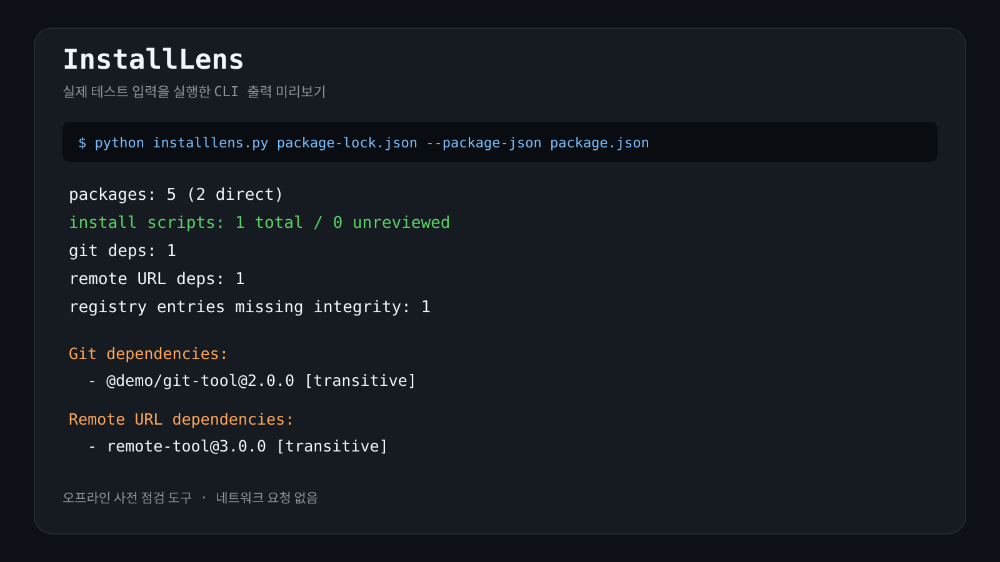

# InstallLens

`package-lock.json`을 설치 전에 오프라인으로 읽어 **설치 스크립트 승인 필요 항목, Git/원격 URL 의존성, integrity 누락**을 빠르게 정리합니다.

[](preview.svg)

Python 표준 라이브러리만 사용하고 lockfile을 외부 서비스로 보내지 않습니다.

## 실행

```bash
python installlens.py /path/to/package-lock.json
python installlens.py /path/to/package-lock.json --package-json /path/to/package.json
python installlens.py /path/to/package-lock.json --package-json /path/to/package.json --strict
```

`--strict`는 검토할 항목이 있으면 종료 코드 2를 반환합니다. `--json`을 붙이면 결과를 JSON으로 출력합니다.

## 확인 항목

- `hasInstallScript`가 있지만 `allowScripts`에서 승인되지 않은 패키지
- Git 소스 의존성
- 기본 npm 레지스트리 밖의 원격 URL 의존성
- 기본 npm 레지스트리 항목 중 integrity가 없는 항목
- 각 항목이 루트의 직접 의존성인지 전이 의존성인지

## 테스트

```bash
python -m unittest -v test_installlens.py
```

이 도구는 lockfile 기반 **설치 전 검토 보조 도구**이며 악성 코드 판정기가 아닙니다. 런타임 코드에 숨은 동작은 lockfile만으로 알 수 없고, 사설 레지스트리 URL은 원격 URL 항목으로 표시될 수 있습니다. package-lock v2/v3의 `packages` 메타데이터를 대상으로 합니다.

## 배경과 대안

npm v12에서 의존성 설치 스크립트, Git 의존성, 원격 URL 의존성이 기본 opt-in으로 바뀌었습니다. InstallLens는 npm 자체 정책 명령을 대체하지 않고, 설치 전에 현재 lockfile에서 검토 범위를 로컬로 보여주는 데 초점을 둡니다.

- npm install 정책: https://docs.npmjs.com/cli/install/
- npm v12 보안 기본값 발표: https://github.blog/changelog/2026-07-08-npm-install-time-security-and-gat-bypass2fa-deprecation/
- Socket: https://socket.dev/ — 더 넓은 패키지 위협 분석 서비스
- 런타임 코드 기반 npm 악성 패키지 사례: https://checkmarx.com/zero-post/npm-btree-malware-campaign-affects-millions-of-downloads-no-need-for-install-script/
