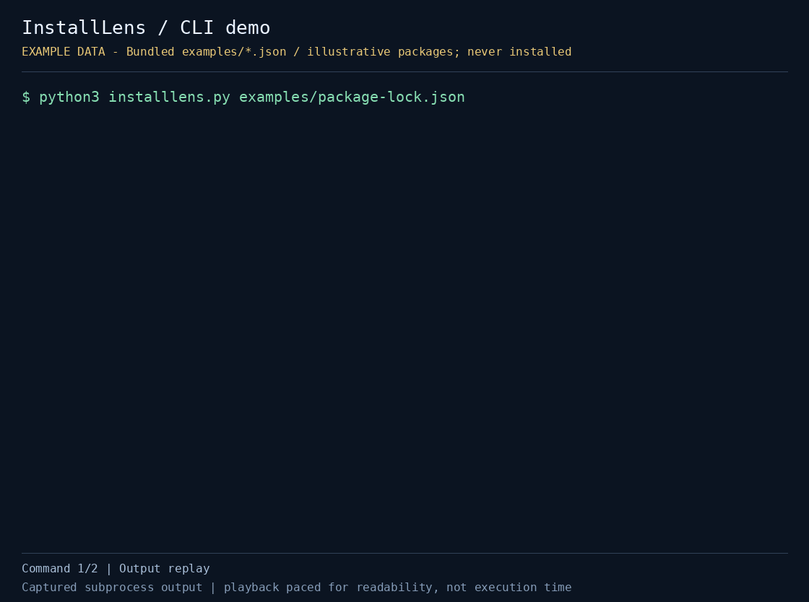

# InstallLens

`package-lock.json`을 설치 전에 오프라인으로 읽어 **미검토 설치 스크립트, Git/원격 URL 의존성, integrity 누락**을 정리하는 CLI입니다. npm 설치를 실행하거나 패키지 내용을 다운로드하지 않습니다.

Python 3 표준 라이브러리만 사용하며 lockfile을 외부 서비스로 보내지 않습니다.

[](demo.gif)

저장소에 포함된 예제/fixture 데이터로 실행한 실제 CLI 출력입니다. 재생 속도는 읽기 편하게 조정했습니다. 예제 패키지·버전·출처는 동작 설명용이며 실제 레지스트리 조사나 보안 판정 결과가 아닙니다.

[정지 미리보기](preview.png) · [실행 출력](demo-transcript.txt) · [캡처 정보](demo-capture.json)

## 빠른 실행

저장소 루트에서 실행합니다.

```bash
cd projects/installlens
python3 installlens.py examples/package-lock.json
python3 installlens.py examples/package-lock.json --package-json examples/package.json
python3 installlens.py examples/package-lock.json --package-json examples/package.json --strict
```

`--strict` 예제는 검토 대상이 남아 있으면 의도적으로 종료 코드 `2`를 반환합니다.

실제 프로젝트의 파일을 검사하려면 경로를 바꿉니다.

```bash
python3 installlens.py /path/to/package-lock.json --package-json /path/to/package.json
python3 installlens.py /path/to/package-lock.json --package-json /path/to/package.json --json
```

- `lockfile`: `packages` 객체를 가진 package-lock v2/v3 형식의 파일
- `--package-json PATH`: `allowScripts` 정책을 읽을 선택적 파일. 생략하면 설치 스크립트가 있는 모든 패키지를 미검토로 표시합니다
- `--json`: 전체 항목과 분류별 결과를 JSON으로 출력합니다
- `--strict`: 네 가지 검토 분류 중 하나라도 남아 있으면 종료 코드 `2`를 반환합니다
- `--help`: 명령행 도움말을 표시합니다

일반적인 성공은 `0`, 처리되는 입력 오류(파일 없음, 잘못된 JSON, 필수 `packages` 객체 누락 등)는 `1`입니다. `--strict`의 `2`는 악성 판정이 아니라 검토할 항목이 있다는 뜻입니다. 잘못된 명령행 인수도 argparse에 의해 `2`를 반환할 수 있습니다.

## 확인 항목과 승인 해석

- `Unreviewed install scripts`: `hasInstallScript`가 있지만 전달한 `allowScripts`에서 `true`로 표시되지 않은 패키지
- `Git dependencies`: `git+`, `git://`, `github:`, `git@`로 시작하는 소스
- `Remote URL dependencies`: HTTP(S) 소스 중 호스트가 `registry.npmjs.org`가 아닌 항목
- `Registry entries missing integrity`: 기본 레지스트리 HTTP(S) 항목 중 `integrity`가 없고 링크 항목도 아닌 경우

`allowScripts`는 객체여야 합니다. `패키지명@버전` 키가 있으면 `패키지명` 키보다 우선하고, JSON 불리언 `true`만 승인으로 읽습니다. 이 도구의 표시가 npm 설정을 바꾸거나 스크립트 실행을 허용하지는 않습니다.

`direct`/`transitive` 표시는 lockfile 루트의 `dependencies`, `devDependencies`, `optionalDependencies`, `peerDependencies`에 패키지명이 있는지로 구분합니다. 전체 의존성 그래프를 추적한 결과는 아니며, 같은 이름의 중첩 설치도 직접 의존성으로 표시될 수 있습니다.

## 테스트

프로젝트 디렉터리에서 실행합니다.

```bash
python3 -m unittest -v test_installlens.py
```

검토 분류, 정확한 버전 승인, 명시적 거부, 필수 입력 구조, strict 종료 코드를 확인합니다.

## 제한

설치 전 검토를 돕는 도구이며 **악성 코드 판정기가 아닙니다**. 패키지 코드·서명·provenance를 검사하지 않고 integrity 값의 존재만 확인합니다. 런타임 코드에 숨은 동작은 알 수 없으며 사설 레지스트리도 원격 URL로 표시합니다. `resolved`가 없거나 다른 형식인 항목은 제한적으로만 분류하고, 모든 lockfile 스키마 오류를 검증하지는 않습니다.

## 데모 다시 만들기

캡처 환경에 Pillow를 설치한 뒤 저장소 루트에서 실행합니다.

```bash
python3 automation/capture_cli_demos.py --project installlens
```

Pillow는 GIF/PNG 생성에만 필요하며 InstallLens 실행에는 필요하지 않습니다. 캡처 시 위에 연결된 실행 출력과 메타데이터도 저장합니다.

## 참고와 대안

- [npm install 문서](https://docs.npmjs.com/cli/install/): 실제 설치 동작과 정책은 사용하는 npm 버전의 문서를 확인하세요
- [Socket](https://socket.dev/): 패키지 위협 분석 서비스. InstallLens는 기존 lockfile을 로컬에서 읽는 좁은 사전 점검에 집중합니다
