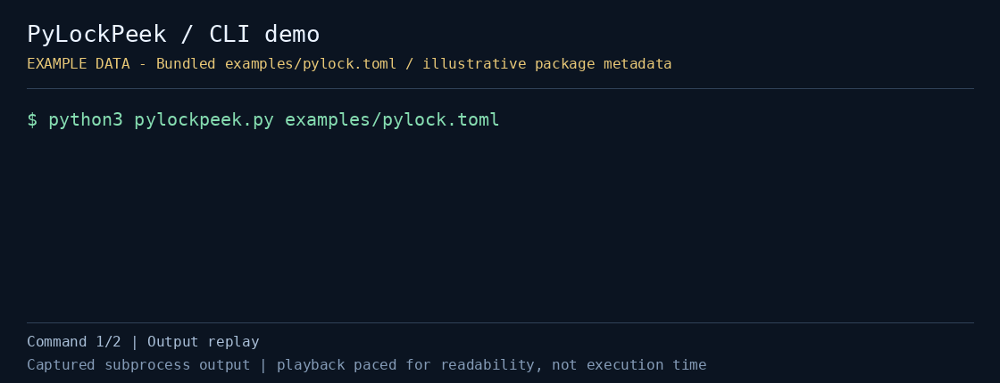

# PyLockPeek

Python의 표준 잠금 파일 형식인 `pylock.toml`을 설치나 네트워크 접근 없이 읽어 패키지별 wheel/sdist/VCS/로컬 디렉터리 구성을 보여주는 CLI다.

`tomllib`을 사용하는 **Python 3.11+** 표준 라이브러리 도구이며 추가 패키지는 필요하지 않다.

[](demo.gif)

저장소에 포함된 예제/fixture 데이터로 실행한 실제 CLI 출력이다. 재생 속도는 읽기 편하게 조정했다. 예제 artifact 이름은 형식 설명용이며 실제 배포 파일의 존재나 설치 가능성을 보증하지 않는다.

[정지 미리보기](preview.png) · [실행 출력](demo-transcript.txt) · [캡처 정보](demo-capture.json)

## 빠른 실행

저장소 루트에서 실행한다.

```bash
cd projects/pylockpeek
python3 pylockpeek.py examples/pylock.toml
python3 pylockpeek.py examples/pylock.toml --source-only
python3 pylockpeek.py examples/pylock.toml --source-only --json
```

실제 lock 파일을 읽으려면 경로를 바꾼다.

```bash
python3 pylockpeek.py /path/to/pylock.toml --json
```

- `lockfile`: 읽을 TOML 파일. `lock-version = "1.0"`, 비어 있지 않은 `created-by`, 각 패키지의 `name`이 필요하다
- `--source-only`: sdist 항목이 있고 wheel 목록은 없는 패키지만 보여준다
- `--json`: 생성 도구, `requires-python`, 패키지 목록, source-only 개수를 JSON으로 출력한다
- `--help`: 명령행 도움말을 표시한다

정상 입력은 종료 코드 `0`, 파일 읽기·TOML 파싱·처리되는 검증 오류는 `2`를 반환한다.

## 결과 읽기

- `wheel:N`: 기록된 wheel 목록의 항목 수
- `sdist`: sdist 객체가 있음
- `vcs`, `directory`, `archive`: 해당 소스 객체가 있음
- `metadata-only`: 위 형태의 artifact/소스가 발견되지 않음
- 버전이 없으면 `(unversioned)`로 표시함

예제는 wheel과 sdist가 있는 패키지, sdist만 있는 패키지, 로컬 디렉터리 패키지를 하나씩 포함한다. `--source-only`는 두 번째 패키지만 보여준다. 이름과 달리 VCS·디렉터리 소스를 모두 포함하는 필터는 아니다.

필터를 사용해도 텍스트 머리말의 전체 패키지 수와 source-only 수는 원본 파일 기준이다. JSON에서는 `packages`만 필터링하고 `source_only` 합계는 원본 파일 기준으로 유지한다.

## 테스트

프로젝트 디렉터리에서 실행한다.

```bash
python3 -m unittest -v test_pylockpeek.py
```

artifact 분류, source-only 집계와 JSON 필터, 지원하지 않는 lock 버전, 패키지명 누락을 확인한다.

## 제한

환경 마커나 Python 버전 조건을 평가하지 않고, wheel이 현재 플랫폼에 맞는지도 판단하지 않는다. 의존성을 설치·해결하거나 artifact URL·해시·실제 파일을 검증하지 않으며, 전체 pylock 스키마 검증기도 아니다.

`source-only` 표시는 설치 실패 판정이 아니라 lock 파일에 기록된 artifact 종류에 대한 정보다. 파일의 환경별 조건에 따라 실제로 선택되는 artifact는 달라질 수 있다.

## 데모 다시 만들기

Python 3.11+와 Pillow가 있는 캡처 환경에서 저장소 루트를 기준으로 실행한다.

```bash
python3 automation/capture_cli_demos.py --project pylockpeek
```

Pillow는 GIF/PNG 생성에만 필요하다. PyLockPeek 실행에는 필요하지 않다. 캡처 시 위에 연결된 실행 출력과 메타데이터도 저장한다.

## 배경과 대안

- [pylock.toml 명세](https://packaging.python.org/en/latest/specifications/pylock-toml/)
- [pip lock](https://pip.pypa.io/en/stable/cli/pip_lock/)
- [uv 문서](https://docs.astral.sh/uv/)

PyLockPeek은 lock 생성·설치 도구를 대체하지 않고, 기존 파일을 바꾸지 않은 채 구조를 빠르게 읽는 데 집중한다.
