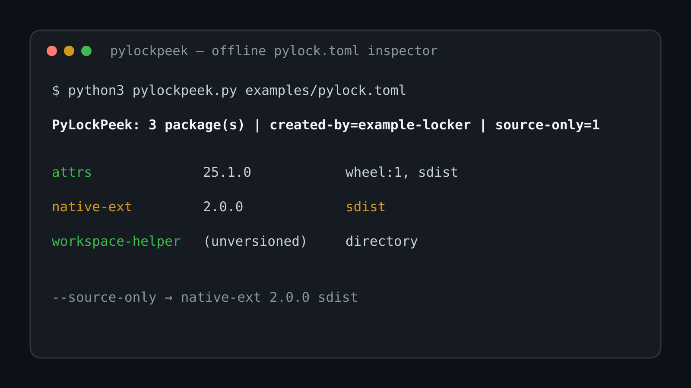

# PyLockPeek

Python의 표준 잠금 파일 `pylock.toml`을 설치나 네트워크 접근 없이 읽어 패키지별 wheel/sdist/VCS/로컬 디렉터리 구성을 보여주는 CLI다.

[](preview.svg)

## 실행

```bash
python3 pylockpeek.py examples/pylock.toml
python3 pylockpeek.py examples/pylock.toml --source-only
```

Python 3.11+ 표준 라이브러리만 사용한다. `--json`으로 구조화된 결과도 출력한다.

## 테스트

```bash
python3 -m unittest -v test_pylockpeek.py
```

## 제한

환경 마커를 평가하거나 의존성을 설치·해결하지 않는다. sdist-only 표시는 설치 실패 판정이 아니라 lock 파일에 기록된 artifact 종류를 보여주는 정보다.

## 배경과 대안

- https://packaging.python.org/en/latest/specifications/pylock-toml/
- https://pip.pypa.io/en/stable/cli/pip_lock/
- https://docs.astral.sh/uv/concepts/preview/

pip lock과 uv는 lock 생성·설치를 담당한다. PyLockPeek은 기존 표준 lock 파일을 바꾸지 않고 빠르게 읽는 데 집중한다.
