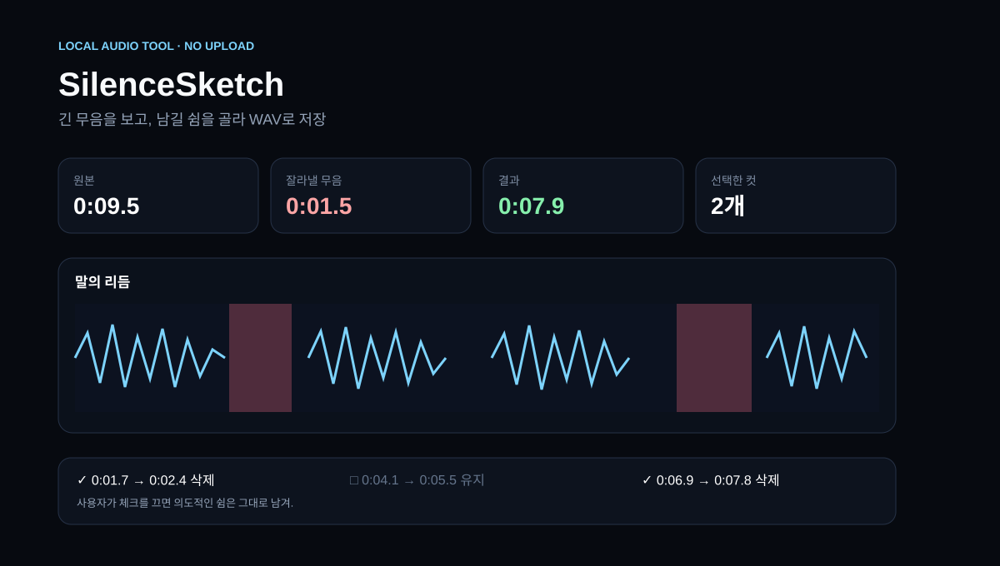

# SilenceSketch



말이 없는 긴 구간을 파형 위에 바로 표시하고, 지울 쉼과 남길 쉼을 직접 고른 뒤 정리된 WAV를 만드는 로컬 브라우저 도구야. 오디오는 서버로 업로드하지 않아.

## 실행

```bash
cd projects/silencesketch
python3 -m http.server 8080
```

브라우저에서 `http://localhost:8080`을 열고 오디오를 끌어놓거나 **9초 데모**를 누르면 돼.

## 할 수 있는 것

- 브라우저가 해석할 수 있는 오디오 파일을 로컬에서 열기
- 무음 기준(dB), 최소 무음 길이, 말끝 여유를 움직이며 결과를 즉시 비교
- 제안된 컷마다 체크를 꺼서 의도적인 쉼 보존
- 실제 잘린 오디오를 16-bit PCM WAV로 저장
- 파일 없이도 9초 가상 음성 데모로 전체 흐름 체험

## 검증

```bash
node test_audio_core.js
```

핵심 무음 검출·구간 제거·WAV 인코딩은 Node 테스트 5개로 확인했고, `app.js`와 `audio-core.js` 문법 검사도 통과했어. `preview.svg`는 같은 데모 입력의 검증 결과를 사용해 핵심 화면 상태를 보여주는 저장소 미리보기야.

## 제한

현재는 결과를 WAV로 내보내기 때문에 MP3/M4A 원본 코덱은 유지하지 않아. 긴 파일은 브라우저 메모리를 많이 사용할 수 있고, 에너지 기반 무음 감지라 조용한 배경음까지 무음으로 판단할 수 있어. 이번 실행 환경의 관리형 Chromium은 로컬 URL 접근을 차단해서 브라우저 상호작용 E2E는 완료하지 못했어.
