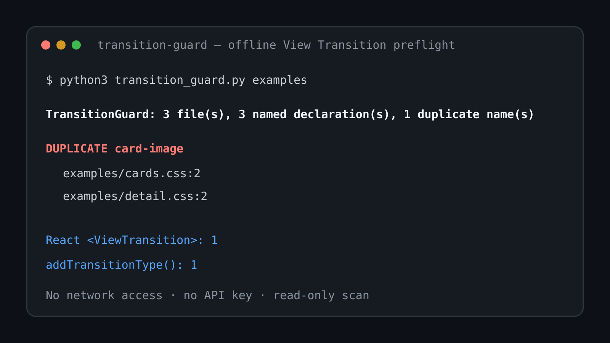

# TransitionGuard

React/CSS 프로젝트에서 View Transition 사용 위치를 오프라인으로 훑고, 정적으로 중복된 `view-transition-name`을 빠르게 찾아주는 CLI야.

[](preview.svg)

## 실행

```bash
python3 transition_guard.py examples
python3 transition_guard.py /path/to/project --fail-on-duplicate
python3 transition_guard.py /path/to/project --json
```

Python 표준 라이브러리만 사용해. `.css`, `.js`, `.jsx`, `.ts`, `.tsx` 파일을 읽고 사용자 지정 `view-transition-name` 중복, `view-transition-class`, React `<ViewTransition>`, `addTransitionType('...')` 사용을 보여줘.

## 테스트

```bash
python3 -m unittest -v test_transition_guard.py
```

## 왜 필요한가

React 19.3에서 `<ViewTransition>`과 `addTransitionType`이 안정화됐고, 브라우저 View Transition에서는 동시에 렌더링되는 두 요소가 같은 사용자 지정 `view-transition-name`을 가지면 전환이 건너뛰어질 수 있어. TransitionGuard는 브라우저를 띄우기 전에 코드베이스의 잠재적인 이름 충돌을 빠르게 찾는 데 집중해.

## 제한

같은 이름이 서로 절대 동시에 렌더링되지 않는 선택자에 쓰였을 수도 있어서, 중복 표시는 오류 확정이 아니라 검토 신호야. 동적으로 만들어지는 이름과 런타임 DOM 상태는 판단하지 않아.
