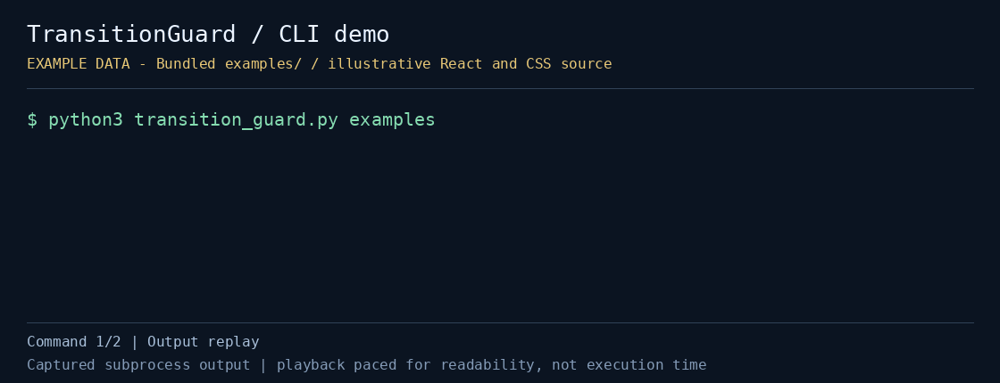

# TransitionGuard

React/CSS 프로젝트에서 View Transition 사용 위치를 오프라인으로 훑고, 정적으로 중복된 `view-transition-name`을 빠르게 찾아주는 CLI야. Python 표준 라이브러리만 사용하고 브라우저나 Node.js를 실행하지 않아.

[](demo.gif)

저장소에 포함된 예제/fixture 데이터로 실행한 실제 CLI 출력이야. 재생 속도는 읽기 편하게 조정했어. 예제는 중복 이름을 보여주기 위한 소스 코드이며 실제 브라우저 전환을 녹화한 화면은 아니야.

[정지 미리보기](preview.png) · [실행 출력](demo-transcript.txt) · [캡처 정보](demo-capture.json)

## 빠른 실행

저장소 루트에서 실행해.

```bash
cd projects/transition-guard
python3 transition_guard.py examples
python3 transition_guard.py examples --json
python3 transition_guard.py examples --fail-on-duplicate
```

예제의 중복 이름 때문에 마지막 명령은 의도적으로 종료 코드 `1`을 반환해.

실제 프로젝트에서는 검사할 파일이나 디렉터리를 하나 이상 지정하면 돼.

```bash
python3 transition_guard.py /path/to/project/src --fail-on-duplicate
python3 transition_guard.py /path/to/cards.css /path/to/Gallery.jsx --json
```

- 위치 인수: 하나 이상의 파일 또는 디렉터리. 디렉터리는 재귀적으로 읽어
- `--json`: 모든 발견 위치를 구조화된 JSON으로 출력해
- `--fail-on-duplicate`: 같은 사용자 지정 이름이 두 번 이상 발견되면 종료 코드 `1`을 반환해
- `--help`: 명령행 도움말을 보여줘

기본 실행은 중복이 있어도 `0`을 반환하고, 경로·파일 읽기·문자 인코딩 오류는 `2`를 반환해. 지원 확장자가 없으면 0개 파일 결과를 출력해.

## 무엇을 찾나

`.css`, `.js`, `.jsx`, `.ts`, `.tsx` 파일에서 다음 패턴을 찾아.

- 정적인 `view-transition-name` 선언과 같은 이름이 나온 파일·줄 위치
- `view-transition-class` 사용 위치
- JavaScript/TypeScript 계열 파일의 React `<ViewTransition>` 위치
- 문자열 리터럴로 호출한 `addTransitionType('...')`의 타입과 위치

`none`, `match-element`, `inherit`, `initial`, `revert`, `revert-layer`, `unset`은 중복 이름 검사에서 제외해. 같은 `view-transition-class`를 여러 번 쓰는 것은 인벤토리로만 기록하고 중복 오류로 처리하지 않아.

텍스트에는 검사한 파일 수, 이름 선언 수, 중복 이름과 위치, React/타입 호출 개수가 나와. 클래스 목록과 각 사용 위치까지 보려면 `--json`을 사용해. 예제에서는 두 CSS 파일의 `card-image`가 중복 이름으로 표시돼.

## 테스트

프로젝트 디렉터리에서 실행해.

```bash
python3 -m unittest -v test_transition_guard.py
```

중복·고유 이름, 제외 키워드, 블록 주석, React/타입 패턴, 클래스 인벤토리, JSON과 종료 코드, 지원하지 않는 확장자를 확인해.

## 제한

중복 표시는 검토 신호야. 같은 이름이 서로 다른 화면이나 동시에 렌더링되지 않는 요소에 쓰였을 수도 있어. 런타임 DOM, 실제 CSS 적용 범위, 브라우저 지원, React 버전 호환성은 확인하지 않아.

정규식 기반 검사이므로 완전한 CSS/JavaScript 파서가 아니야. 블록 주석은 제외하지만 문자열·한 줄 주석의 예제 코드가 발견될 수 있고, 동적 이름·별칭·여러 줄 패턴은 놓칠 수 있어. `<ViewTransition>` 개수는 해당 패턴이 있는 줄 수야. 디렉터리 제외 규칙이 없어서 `node_modules`나 생성물이 섞인 루트보다 필요한 소스 디렉터리를 지정하는 게 좋아.

## 데모 다시 만들기

캡처 환경에 Pillow를 설치한 뒤 저장소 루트에서 실행해.

```bash
python3 automation/capture_cli_demos.py --project transition-guard
```

Pillow는 GIF/PNG 생성에만 필요하고 TransitionGuard 실행에는 필요하지 않아. 캡처 시 위에 연결된 실행 출력과 메타데이터도 저장해.
